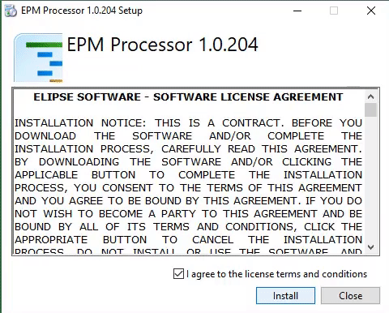

# EPM Processor - Quickstart

Manual para início rápido de desenvolvimento. Para informações detalhadas, consulte o manual do usuário.

## Introdução

O EPM Processor é uma plataforma para criação e execução de scripts Python, baseada em eventos ou simulações, totalmente integrada ao sistema [EPM](https://www.elipse.com.br/produto/elipse-plant-manager/).
Veremos a seguir como inserir um algorítmo, testá-lo e colocá-lo em produção.  

### Pré-requisitos

* EPM Server ativo na rede
* Usuário e senha do EPM Server
* EPM WebServer instalado e configurado
* Instalação do Python 3.6 ou superior

### Instalação

Faça o download do EPM Processor em nosso [site](www.elipse.com.br/downloads).

Execute o instalador como Administrador do Sistema (clique com botão direito -> Executar como Administrador).

Durante a instalação, será perguntado o diretório de instalação para o MongoDB (banco de dados não-relacional). Recomendamos deixar o diretório padrão.

Após isso será perguntado qual o diretório onde o Python 3.6+ está instalado,  insira o caminho, aperte em confirmar e aguarde a instalação terminar. 

## Contributing

Please read [CONTRIBUTING.md](https://gist.github.com/lucaskotres/b24679402957c63ec426) for details on our code of conduct.

## Authors

***REMOVED***

## License

This project is licensed under the MIT License - see the [LICENSE.md](https://github.com/lucaskotres/ElipseExamples/blob/master/contributing.md) file for details

## Acknowledgments

***REMOVED***
***REMOVED***
***REMOVED***

